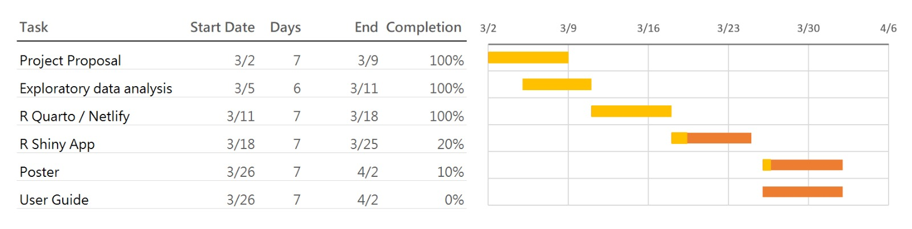

## Project Motivation & Objective

The Colombian fintech sector has experienced rapid growth, reaching nearly 400 companies by 2024. Despite this expansion, understanding the underlying drivers of customer satisfaction and financial engagement remains a significant challenge.

### Motivation

Most fintech analyses focus on surface-level reporting such as total transaction volume or average values. However, these metrics do not explain *why* customers behave differently across segments.

Fintech users are highly heterogeneous. For example:

-   Some users exhibit high transaction frequency but low financial value\
-   Others contribute significantly to total transaction volume but engage less frequently\
-   Certain groups may be highly digitally engaged but not financially active

Traditional analysis methods are limited in capturing these behavioural differences.

### Objective

The objective of this project is to understand the behaviours behind customer transactions and how socio-demographic factors—such as age, income, and education—affect financial activity within the Colombian fintech ecosystem.

Specifically, the project aims to:

-   Identify the key drivers of customer transaction behaviour\
-   Understand how demographic groups influence financial activity\
-   Segment customers based on behavioural and engagement characteristics\
-   Develop predictive models to estimate customer behaviour\
-   Design a visual analytics application to support interactive exploration

------------------------------------------------------------------------

## Data Overview: COFINFAD Dataset

The COFINFAD dataset captures the transition from traditional cash-based behaviour to a digital-first financial ecosystem.

### Data Structure

The dataset consists of two main components:

-   **Customer-Level Dataset (48,723 records)**\
    Contains demographic, behavioural, engagement, and satisfaction attributes

-   **Transaction-Level Dataset (3.1 million records)**\
    Contains detailed transaction information such as:

    -   Transaction amount\
    -   Transaction date\
    -   Transaction type

Both datasets are linked through a common identifier: `customer_id`.

------------------------------------------------------------------------

### Key Variable Categories

| Category | Variables | Purpose |
|----|----|----|
| Demographics | Age, Income, Education, Household Size | Customer segmentation |
| Engagement | App logins, Feature usage, Active products | Digital behaviour |
| Financial | Transaction count, Avg value, Total volume | Financial activity |
| Sentiment | Satisfaction score, NPS score | Customer experience |

------------------------------------------------------------------------

## Analytical Framework (Integrated Approach)

The project adopts a three-stage analytical framework combining exploratory analysis, customer segmentation, and predictive modelling.

------------------------------------------------------------------------

### Exploratory & Confirmatory Analysis (EDA & CDA)

The first stage focuses on identifying relationships between socio-demographic variables and financial behaviour.

Key behavioural indicators include:

-   Transaction count (`tx_count`)\
-   Average transaction value (`avg_tx_value`)

Due to the skewed nature of financial data, non-parametric statistical methods are used. Visual analytics techniques such as distribution plots, boxplots, and faceted comparisons are applied to explore how different demographic groups influence transaction behaviour.

This stage provides the foundational understanding of behavioural patterns across the customer base.

------------------------------------------------------------------------

### Customer Segmentation (K-Means Clustering)

The second stage applies **K-Means clustering (k = 4)** to group customers based on behavioural characteristics.

Clustering is performed using variables from three dimensions:

#### Transaction Behaviour

-   Transaction count\
-   Average transaction value\
-   Transaction frequency

#### Digital Engagement

-   App login frequency\
-   Feature usage diversity\
-   Active products

#### Customer Value & Risk

-   Satisfaction score\
-   Churn probability\
-   Customer lifetime value

This approach identifies distinct customer segments such as:

-   High-value customers\
-   Digitally engaged users\
-   Moderate activity users\
-   Low engagement segments

These clusters provide a structured way to interpret customer behaviour at scale.

------------------------------------------------------------------------

### Predictive Modelling

The final stage extends the analysis by developing predictive models to estimate key customer outcomes.

------------------------------------------------------------------------

#### Customer Satisfaction Prediction (Supporting Analysis)

-   Target variable: **satisfaction_score**\
-   Models used:
    -   Linear Regression\
    -   Decision Tree\
    -   Random Forest

This component evaluates how demographic, behavioural, and engagement variables influence customer experience.

However, the results show relatively low explanatory power, indicating that customer satisfaction is influenced by factors not fully captured in the dataset.

------------------------------------------------------------------------

#### 2. Transaction Behaviour Prediction (Primary Focus)

-   Target variable: **avg_daily_transactions (log-transformed)**\
-   Models used:
    -   Linear Regression\
    -   Decision Tree\
    -   Random Forest

The target variable exhibits strong right-skewness. To address this, a logarithmic transformation (`log1p`) is applied.

This modelling component focuses on financial activity, which is more directly aligned with the project objective.

Among the models, Random Forest demonstrates the best predictive performance, indicating that non-linear relationships play an important role in explaining transaction behaviour.

------------------------------------------------------------------------

### Integrated Insight

By combining:

-   Statistical analysis (EDA/CDA)\
-   Behavioural segmentation (Clustering)\
-   Predictive modelling

the project provides a comprehensive understanding of:

-   Why customers behave differently\
-   How customer behaviour can be predicted\
-   Which factors drive financial activity in fintech platforms

------------------------------------------------------------------------

## Proposed Visual Analytics Application

### Core R Packages

The application relies on a robust stack of R packages to handle data manipulation, statistical testing, and advanced visual analytics:

-   **UI & Reactivity:** `shiny`, `shinydashboard`

-   **Data Manipulation:** `tidyverse` (specifically `dplyr` for data wrangling and `mutate`/`cut` for binning continuous variables).

-   **Statistical Visualisations:** \* `ggstatsplot`: For generating confirmatory data analysis (CDA) plots with rich statistical details (`ggbetweenstats`, `ggbarstats`).

    -   `ggdist`: For creating advanced distribution visualisations like Raincloud plots (`stat_halfeye`, `stat_dots`).

-   **Aesthetics & Formatting:** \* `ggthemes`: To apply professional, publication-ready themes (`theme_economist()`).

    -   `scales`: For formatting heavily skewed financial axes (`scale_y_log10`, `label_number`).

### Module 1: Exploratory & Confirmatory Analysis (EDA & CDA)

This module serves as the foundational entry point, allowing users to dynamically cross-filter socio-demographic factors against financial behaviors.

**UI Layout & Components:**

-   **Inputs:** Utilises `selectInput()` within `box()` containers to allow users to select specific demographic variables (e.g., Education Level, Income Bracket) and financial metrics (e.g., Transaction Count, Total Volume).

-   **Layout:** Employs reactive `fluidRow()` grids. To manage memory and avoid cognitive overload, heavy visualisations are grouped using `tabBox()` and `tabPanel()` for lazy loading.

-   **Outputs:** Multiple `plotOutput()` elements rendering responsive `ggplot2` charts.

**Core Analytical Functions:**

-   **EDA:** Generates Raincloud plots combining `stat_halfeye()`, `geom_boxplot()`, and `stat_dots()` to show both density and exact data points. Financial metrics utilize `geom_histogram()` and `stat_ecdf()` for cumulative proportion tracking. `reactive()` expressions are used server-side to prevent redundant calculations.

-   **CDA (ANOVA Test Tab):** Uses `ggbetweenstats()` to perform robust, nonparametric analysis of variance comparing average transaction values across selected demographics.

-   **CDA (Association Tab):** Uses `ggbarstats()` to perform Chi-Square tests of association, visualizing the relationship between dynamically binned financial metrics and demographic groups.

### Module 2: Customer Segmentation (Clustering)

**Developer:** Chandru Kolanchiyappan

This module utilizes unsupervised machine learning to group customers with similar financial behaviors, digital engagement levels, and socio-demographic characteristics, moving beyond simple demographic profiling to establish true behavioral personas.

**UI Layout & Components:**

-   **Inputs:** `sliderInput()` to allow users to dynamically adjust the number of clusters (*k*), alongside `selectInput()` to toggle which specific feature space (e.g., Financial Metrics vs. Engagement Metrics) to project onto the visualisations.

-   **Layout:** A multi-pane `fluidRow()` layout. The top section handles cluster evaluation diagnostics (Elbow and Silhouette plots) via a `tabBox()`. The main body contrasts 2D cluster projections with standard profiling charts (boxplots and parallel coordinates).

-   **Outputs:** Multiple `plotOutput()` elements designed to handle both base R statistical plots and advanced `ggplot2`/`factoextra` objects.

**Core Analytical Functions & Packages:**

-   **Pre-processing:** Uses `tidyr::drop_na()` for handling missing values and base R `scale()` to standardize the 12 selected continuous variables (e.g., `tx_count`, `customer_lifetime_value`, `app_logins_frequency`) so they contribute equally to the distance calculations.

-   **Feature Selection:** Employs the `corrplot` package to generate correlation matrices, ensuring redundant variables are identified prior to clustering.

-   **Clustering Algorithm:** Utilises the base R `kmeans()` algorithm (specifically using `nstart = 25` to ensure algorithmic stability) to partition the data.

-   **Evaluation Diagnostics:** Calculates Within-Cluster Sum of Squares (WSS) and Average Silhouette Width (using the `cluster` package) to justify the optimal selection of *k=4* clusters.

-   **Visual Analytics:** \* Uses `factoextra::fviz_cluster()` to project the multi-dimensional clusters onto a 2D Principal Component Analysis (PCA) space, complete with convex hulls.

    -   Uses `ggplot2` to generate diagnostic boxplots (`geom_boxplot`) comparing financial distributions across the 4 clusters, and standardized line plots (`geom_line`) to construct a multi-variable "persona profile" for each segment.

    -   Generates 100% stacked bar charts (`geom_bar(position = "fill")`) to assess demographic compositions (e.g., Income Bracket) within each algorithmically defined cluster.

### Module 3: Predictive Modelling

This module allows users to interact with machine learning models designed to forecast two critical business outcomes: **Customer Satisfaction Scores** (experience-based) and **Average Daily Transactions** (behaviour-based). To account for the heavy right-skewness typical in financial data, the transaction target variable utilizes a log transformation (`log1p`).

**UI Layout & Components:**

-   **Inputs:** `selectInput()` to allow users to toggle between the target variables (Satisfaction vs. Transaction Frequency), and `radioButtons()` to select which machine learning algorithm to evaluate (Linear Regression, Decision Tree, Random Forest, or Ordinal Regression).

-   **Layout:** A structured, multi-row `fluidPage()` or `tabBox()` layout. The top row utilizes `valueBox()` or `infoBox()` elements to present global, real-time performance metrics for the selected model. The main area splits into visual diagnostic panels.

-   **Outputs:** Multiple `plotOutput()` elements to render model diagnostics and tree structures, alongside `dataTableOutput()` for detailed numeric comparisons of model metrics across validation and test sets.

**Core Analytical Functions & Packages:**

-   **Modelling Framework:** The entire predictive pipeline is constructed using the robust **`tidymodels`** ecosystem. This includes using `recipes` for preprocessing (e.g., `step_impute_median()`, `step_dummy()` for categorical encoding, and `step_zv()` to remove zero-variance predictors) and `workflows` to seamlessly bundle preprocessing with model specifications.

-   **Algorithms Implemented:**

    -   **Linear & Ordinal Regression:** Baseline parametric modelling using the `lm` engine to extract interpretable coefficients.

    -   **Decision Trees:** Non-linear, rule-based modelling using the `rpart` engine. Hyperparameters (`tree_depth`, `cost_complexity`, `min_n`) are rigorously tuned using 5-fold cross-validation (`vfold_cv()`) and `tune_grid()`.

    -   **Random Forest:** High-performance ensemble modelling utilizing the `ranger` engine. To optimize the heavy computational load of tuning (`mtry`, `min_n`), the **`doParallel`** package is utilized to register multi-core parallel processing.

-   **Evaluation Metrics:** Uses the `yardstick` package (`metric_set`) to calculate continuous error metrics: RMSE, MAE, and R-squared ($R^2$).

-   **Visual Analytics Integration:**

    -   **Feature Importance:** Employs the **`vip`** package to generate Variable Importance Plots, visually ranking which demographic and engagement factors most heavily dictate financial behavior.

    -   **Tree Interpretability:** Utilizes **`rpart.plot`** and **`partykit`** to render visual, easily interpretable decision tree diagrams for non-technical stakeholders.

    -   **Diagnostic Plots:** Leverages `ggplot2` (assisted by `patchwork` for layout combining) to generate Predicted vs. Actual scatter plots (with an overlaid 45-degree identity line) and Residual plots, allowing users to visually assess error variance and model fit.Visualises the most critical drivers of behaviour using variable importance plots (e.g., `vip::vip()`).

------------------------------------------------------------------------

## Project Timeline and Work Allocation

### Team Responsibilities

-   **EDA & CDA Module** – Ng Meng Ye\
-   **Clustering Module** – Chandru Kolanchiyappan\
-   **Predictive Modelling Module** – Gautamgovan Elangovan

------------------------------------------------------------------------

## Expected Value

This project provides:

-   A deeper understanding of customer financial behaviour\
-   Identification of key drivers of transaction activity\
-   Data-driven insights for fintech decision-making\
-   A scalable visual analytics framework for future applications

The integration of statistical analysis, clustering, and predictive modelling ensures that both behavioural patterns and predictive insights are captured effectively.

------------------------------------------------------------------------
